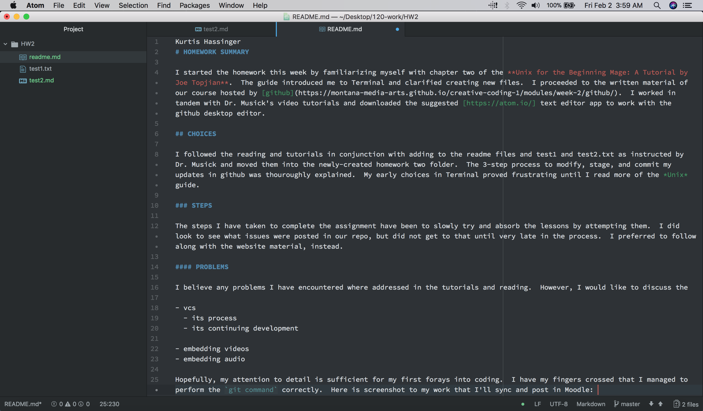

Kurtis Hassinger
# HOMEWORK SUMMARY

I started the homework this week by familiarizing myself with chapter two of the **Unix for the Beginning Mage: A Tutorial by Joe Topjian**.  The guide introduced me to Terminal and clarified creating new files.  I proceeded to the written material of our course hosted by [github](https://montana-media-arts.github.io/creative-coding-1/modules/week-2/github/).  I worked in tandem with Dr. Musick's video tutorials and downloaded the suggested [atom](https://atom.io/) text editor app to work with the github desktop editor.

## CHOICES

I followed the reading and tutorials in conjunction with adding to the readme files and test1 and test2.txt as instructed by Dr. Musick and moved them into the newly-created homework two folder.  The 3-step process to modify, stage, and commit my updates in github was thouroughly explained.  My early choices in Terminal proved frustrating until I read more of the *Unix* guide.

### STEPS

The steps I have taken to complete the assignment have been to slowly try and absorb the lessons by attempting them.  I did look to see what issues were posted in our repo, but did not get to that until very late in the process.  I preferred to follow along with the website material, instead.

#### PROBLEMS

I believe any problems I have encountered where addressed in the tutorials and reading.  However, I would like to discuss the

- vcs
  - its process
  - its continuing development

- embedding videos
- embedding audio

Hopefully, my attention to detail is sufficient for my first forays into coding.  I have my fingers crossed that I managed to perform the `git command` correctly.  Here is screenshot to my work that I'll sync and post in Moodle: .
