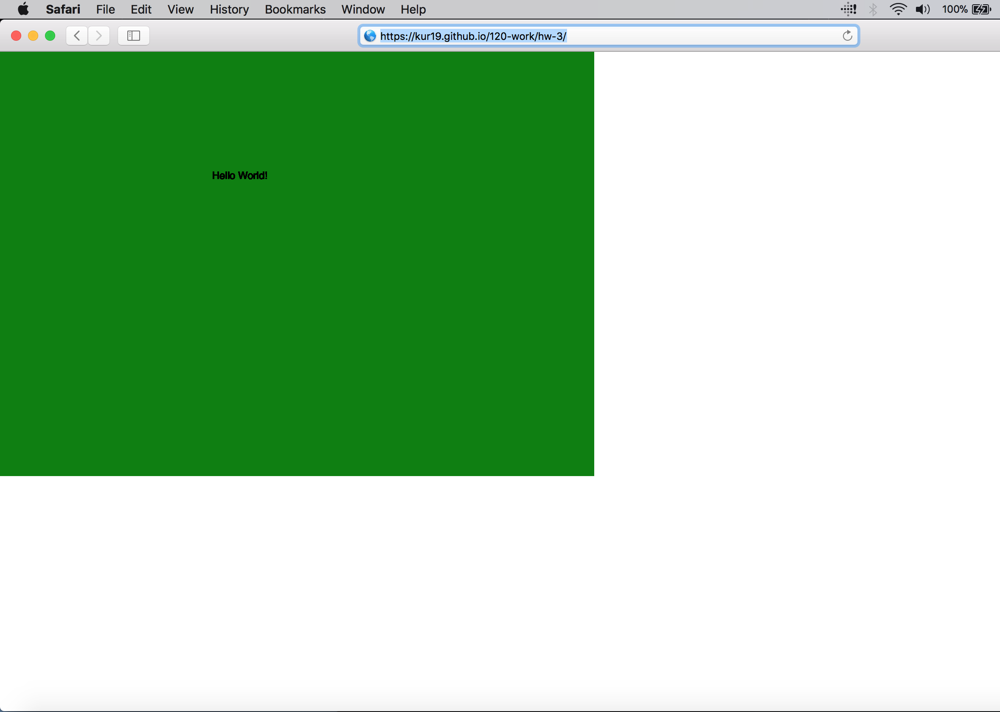

Kurtis Hassinger, 50

["Hello World!"](https://kur19.github.io/120-work/hw-3/)

# HW-3 Response:

I found the work this week to be rewarding in an immediately tangible way.  I had an easier time following along with the tutorials and the p5.js videos regarding the program's creation is tantalizing.  It is exciting to think in terms of being able to write specific code and bring it into platforms such as Isadora for live performance purposes.  However, it seems that coding is so much more than that.

The main issue I encountered this week is in all likelyhood one that will be ongoing; that is information retention.  As I stated, I followed the tutorials closely, but with a propensity for slowness.  I would play, stop, scrub back and forth, until I was able to write, commit, and synch/push my work to the repo and subsequent main branch of Github.  I would guess the time lengthy time it took me to do this is not unique to a first-time coding student and I expect it to improve.

I'm gaining confidence overall in navigating between Atom and Github as well as adjusting to working simultaneously in multiple windows.  I will check in and respond to students who post issues and try and aid them to the best of my novice ability.  I am finding this experience invigorating in many ways!

## Final sketch

Here is my sketch:

