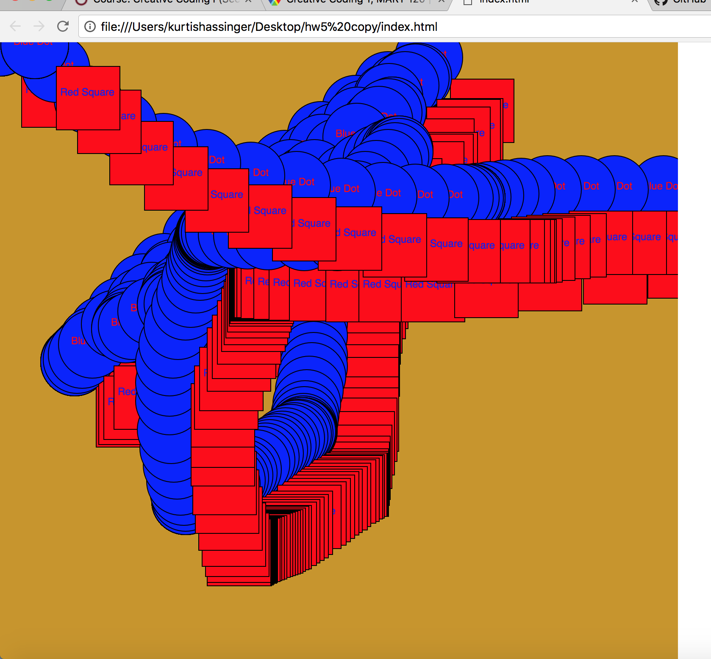

Kurtis hassinger, 50

# HOMEWORK 5: ANIMATION

## Problems

The material for this week introduced us to motion in our coding.  While intimidating, it was thrilling going through the pages and looking at the examples.  I was initially worried regarding the lowered number of video tutorials, however the code examples helped a great deal in my creative process

## process

I jumped back and forth through the pages in the asiignment on our website to refresh myself with the variable rules.  I also visited the links to try and clean up my code in order to make it more user-friendly to the eye.  The examples of code that is hard to read made sense, although I don't think I quite have good syntax down just yet.  I was inspired to make an ellipse that tracked with the mouseX and Y function and I elaborated on it with blue and red color.

### Looking forward

I'm looking forward to more of this.  It is daunting, but every week builds upon the previous and I like that we started in a basic manner.  Again, the code examples and videos are definitely helpful!

Thanks.
